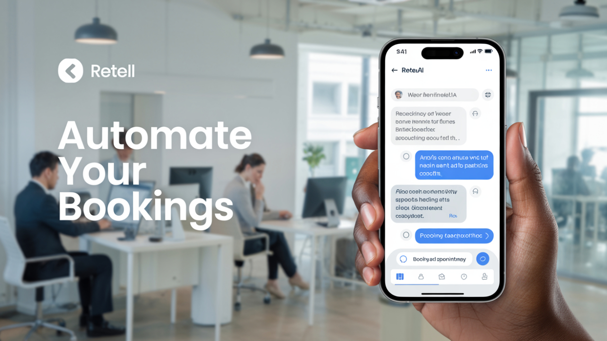
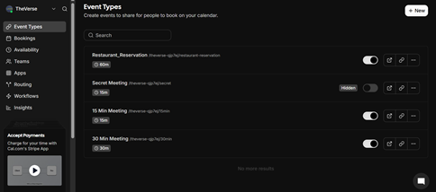
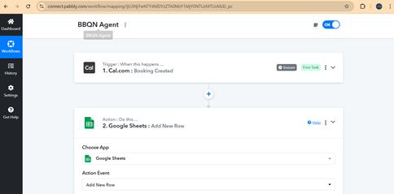
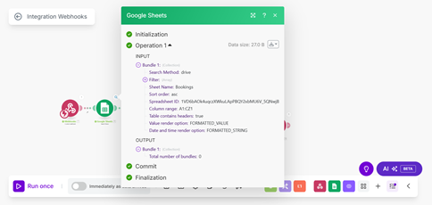
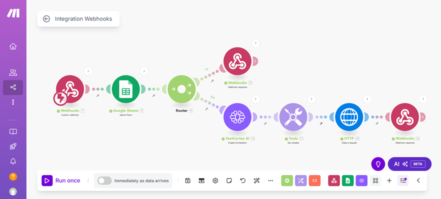
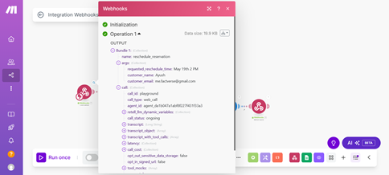
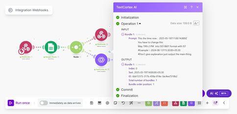
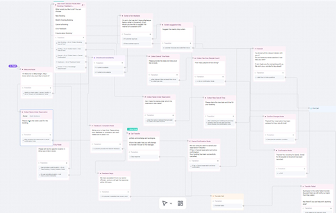
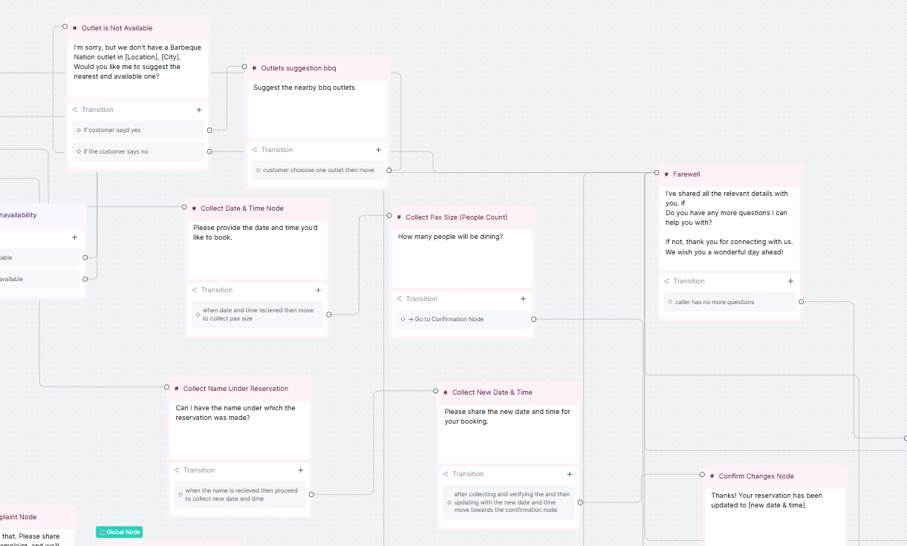
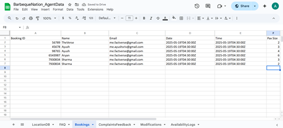

# Barbeque Nation Inbound Enquiry & Booking Chatbot Agent

- Booking Video Link - https://drive.google.com/file/d/167tlKQNTS37xmmKdshFWIwB2no8EjgNu/view?usp=sharing
- Reschedule Booking Video Link - https://drive.google.com/file/d/1DxG6slxHTdlzNUJvbRiDyLqvGEv9vP8M/view?usp=sharing
- Cancel Booking Video Link - https://drive.google.com/file/d/1R_K9rTQXjpb1Pqa_O458jniuxMQau7Cj/view?usp=sharing

## Project Overview

This project is aimed at building a conversational chatbot agent for Barbeque Nation outlets in Delhi and Bangalore. The chatbot handles inbound enquiries including FAQs, new bookings, booking modifications (like rescheduling or cancellations), and complaint logging. It uses multiple integrations such as webhooks, Google Sheets, Pabbly Connect, Cal.com, and conversational AI hooks to manage smooth booking and communication flows.

---

## Table of Contents

- [Purpose](#purpose)
- [System Architecture](#system-architecture)
- [Setup and Configuration](#setup-and-configuration)
- [Implementation Walkthrough](#implementation-walkthrough)
- [API Endpoints](#api-endpoints)
- [Knowledge Base Structure](#knowledge-base-structure)
- [Post-Call Analysis](#post-call-analysis)
- [Screenshots and Visual Aids](#screenshots-and-visual-aids)
- [How to Run](#how-to-run)

---

## Purpose

The chatbot agent is designed to:

- Answer frequently asked questions (FAQs) promptly and accurately.
- Allow customers to book new reservations seamlessly.
- Support modification of existing bookings such as reschedules and cancellations.
- Log customer complaints and feedback for quality assurance.
- Maintain conversational flow using state management and AI hooks.

---

## System Architecture

The system is composed of the following key components:

| Component                   | Description                                                                                 |
| --------------------------- | ------------------------------------------------------------------------------------------- |
| **State Prompt**            | Templates that maintain the chatbot’s current conversational state and context.             |
| **State Transition Prompt** | Logic that governs moving from one conversation state to the next based on user input.      |
| **Knowledge Base**          | Structured property, booking, and FAQ data used for generating chatbot responses.           |
| **Post-Call Configuration** | Mechanism to log conversation outcomes, feedback, and call summaries for analysis.          |
| **Chatbot Interface**       | The user-facing conversational interface built using Retell AI and custom API integrations. |
| **Webhook Handlers**        | Endpoints to receive and process real-time booking updates, especially reschedules.         |
| **Automation Workflow**     | Pabbly Connect flows to automate booking entries and sync data across systems.              |

---

## Setup and Configuration

### 1. Forking and Repository Setup

The project started by forking the `agentops-template-repo` which provides starter code and API scaffolding for chatbot agents.

### 2. Knowledge Base Preparation

- Data was structured across multiple Google Sheets tabs for easy management:
  - `locationDB` (property and branch info)
  - `FAQ` (frequently asked questions)
  - `Booking` (reservations records)
  - `Complaint/Feedback` (customer feedback)
  - `Modification` (booking changes)
  - `AvailabilityLog` (table tracking real-time availability)
  - `My Agent Responses` (preset chatbot replies)
  - `Knowledge Bases Used` (consolidated reference data)

### 3. API Development

- Created RESTful API endpoints to:
  - Fetch segmented knowledge base data in chunks to fit API token limits.
  - Create, update, or cancel bookings through webhook integration.
  - Log detailed post-call summaries for each conversation.
  - Manage conversational states and transitions.

### 4. Pabbly Connect Workflow

- Automated workflows were created to:
  - Add new bookings to the `Booking` Google Sheet automatically from Cal.com reservation data.
  - Listen for booking reschedule events via webhook and update records accordingly.
  - Sync booking data and availability statuses across sheets and chatbot responses.

### 5. Conversational AI Hook Configuration

- Configured Text Cortex AI hooks and router hooks to control chatbot dialog flows dynamically.

---

## Implementation Walkthrough

### Step 1: New Booking Creation

- Customers book reservations using **Cal.com** booking interface.
- Bookings are automatically pushed into the Google Sheets `Booking` tab via **Pabbly Connect** integration.

  
  

---

### Step 2: Booking Modification Handling (Rescheduling)

- A webhook endpoint listens for reschedule events from the booking system.
- When a booking is rescheduled, the webhook receives an update and modifies the corresponding Google Sheet row in `Booking`.

  
  

---

### Step 3: Conversational AI Configuration

- Configured **Text Cortex AI Hooks** for generating dynamic responses based on conversational context.
- Set up **Router Hooks** to handle state transitions depending on user inputs and chatbot interactions.

  

---

### Step 4: Knowledge Base & FAQ Handling

- The FAQs and other knowledge data are stored in Google Sheets with chunking logic to keep each API response within token limits.
- The chatbot queries the knowledge base dynamically to answer customer queries accurately.

---

### Step 5: Conversation Logging & Post-Call Analysis

- After each conversation or call, data including call time, call outcome, booking details, and customer feedback is logged in the `Post-Call Analysis` sheet.
- This log enables the business to analyze conversation quality and customer satisfaction.

---

## API Endpoints

| Endpoint              | Purpose                                    | Description                                            |
| --------------------- | ------------------------------------------ | ------------------------------------------------------ |
| `/knowledge-base`     | Fetches FAQs and knowledge base chunks     | Returns segmented data to avoid token limit exceedance |
| `/booking`            | Create/update/cancel bookings              | Processes booking data from chatbot or webhook         |
| `/post-call-analysis` | Logs completed conversation summaries      | Stores call details for performance monitoring         |
| `/state-transition`   | Controls chatbot state machine transitions | Determines next state based on current context         |

---

## Knowledge Base Structure

| Sheet Name             | Purpose                                |
| ---------------------- | -------------------------------------- |
| `locationDB`           | Branch and property location details   |
| `FAQ`                  | Common customer questions and answers  |
| `Booking`              | Active reservation and booking records |
| `Complaint/Feedback`   | Customer complaint and feedback logs   |
| `Modification`         | Booking reschedules, cancellations     |
| `AvailabilityLog`      | Room/table availability tracking       |
| `My Agent Responses`   | Predefined chatbot reply templates     |
| `Knowledge Bases Used` | Consolidated data references           |

---

## Post-Call Analysis

- Every interaction is logged with key metrics:
  - Call time and modality
  - Phone number and guest count
  - Booking and reservation status
  - Outcome and summary of the conversation
- Logged data is maintained in Google Sheets for ongoing business analysis and chatbot improvement.

---

## Screenshots and Visual Aids

| Image Filename                       | Description                                      |
| ------------------------------------ | ------------------------------------------------ |
| `reschedule_reservation_webhook.png` | Webhook for capturing reschedule booking events  |
| `webhook_reschedule_response.png`    | Confirmation response from webhook               |
| `google_sheet_response.png`          | Google Sheets updated with booking data          |
| `text_cortex_ai_hook.png`            | AI hook configuration for generating responses   |
| `router_hook.png`                    | Router hook managing conversational flow         |
| `cal_com_reservation_booking.png`    | Booking interface from Cal.com                   |
| `pabbly_new_booking.png`             | Adding booking via Pabbly Connect automation     |
| `pabbly_google_sheet_config.png`     | Pabbly configuration for Google Sheets sync      |
| `google_spreadsheet_sheets.png`      | Google Sheets showing knowledge base tabs        |
| `conversational_flow_image.png`      | Diagram illustrating chatbot conversational flow |

---

## How to Run

1. Clone the repository to your local machine.
2. Configure environment variables for API keys and Google Sheets access credentials.
3. Deploy the API backend endpoints on your preferred cloud service or local server.
4. Set up Pabbly Connect workflows to automate bookings and webhook event handling.
5. Use Retell AI to configure the chatbot voice and text conversational agent.
6. Test the booking flow and chatbot conversations thoroughly.
7. Monitor the post-call logs for analysis and improvements.

---

## Contact

If you have any questions or need further assistance, please contact me at:  
`your-email@example.com`

---

**End of README**
