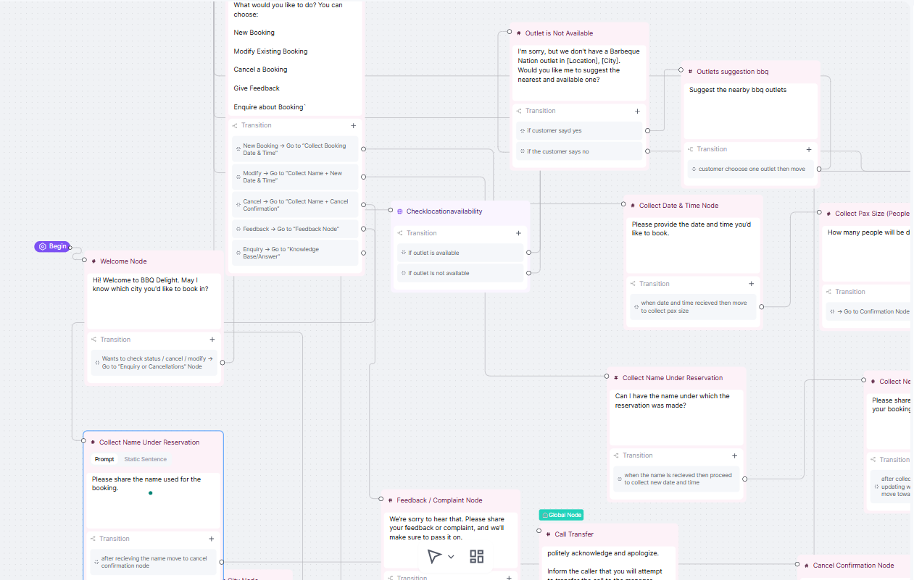

# Barbeque Nation Inbound Enquiry & Booking Chatbot Agent

- Booking Video Link - https://drive.google.com/file/d/167tlKQNTS37xmmKdshFWIwB2no8EjgNu/view?usp=sharing
- Reschedule Booking Video Link - https://drive.google.com/file/d/1DxG6slxHTdlzNUJvbRiDyLqvGEv9vP8M/view?usp=sharing
- Cancel Booking Video Link - https://drive.google.com/file/d/1R_K9rTQXjpb1Pqa_O458jniuxMQau7Cj/view?usp=sharing

## Project Overview

This project is aimed at building a conversational chatbot agent for Barbeque Nation outlets in Delhi and Bangalore. The chatbot handles inbound enquiries including FAQs, new bookings, booking modifications (like rescheduling or cancellations), and complaint logging. It uses multiple integrations such as webhooks, Google Sheets, Pabbly Connect, Cal.com, and conversational AI hooks to manage smooth booking and communication flows.

---

## Table of Contents

- [Purpose](#purpose)
- [System Architecture](#system-architecture)
- [Setup and Configuration](#setup-and-configuration)
- [Implementation Walkthrough](#implementation-walkthrough)
- [API Endpoints](#api-endpoints)
- [Knowledge Base Structure](#knowledge-base-structure)
- [Post-Call Analysis](#post-call-analysis)
- [Screenshots and Visual Aids](#screenshots-and-visual-aids)
- [How to Run](#how-to-run)

---

## Purpose

The chatbot agent is designed to:

- Answer frequently asked questions (FAQs) promptly and accurately.
- Allow customers to book new reservations seamlessly.
- Support modification of existing bookings such as reschedules and cancellations.
- Log customer complaints and feedback for quality assurance.
- Maintain conversational flow using state management and AI hooks.

---

## System Architecture

The system is composed of the following key components:

| Component                   | Description                                                                                 |
| --------------------------- | ------------------------------------------------------------------------------------------- |
| **State Prompt**            | Templates that maintain the chatbot’s current conversational state and context.             |
| **State Transition Prompt** | Logic that governs moving from one conversation state to the next based on user input.      |
| **Knowledge Base**          | Structured property, booking, and FAQ data used for generating chatbot responses.           |
| **Post-Call Configuration** | Mechanism to log conversation outcomes, feedback, and call summaries for analysis.          |
| **Chatbot Interface**       | The user-facing conversational interface built using Retell AI and custom API integrations. |
| **Webhook Handlers**        | Endpoints to receive and process real-time booking updates, especially reschedules.         |
| **Automation Workflow**     | Pabbly Connect flows to automate booking entries and sync data across systems.              |

---

## Setup and Configuration

### 1. Forking and Repository Setup

The project started by forking the `agentops-template-repo` which provides starter code and API scaffolding for chatbot agents.

### 2. Knowledge Base Preparation

- Data was structured across multiple Google Sheets tabs for easy management:
  - `locationDB` (property and branch info)
  - `FAQ` (frequently asked questions)
  - `Booking` (reservations records)
  - `Complaint/Feedback` (customer feedback)
  - `Modification` (booking changes)
  - `AvailabilityLog` (table tracking real-time availability)
  - `My Agent Responses` (preset chatbot replies)
  - `Knowledge Bases Used` (consolidated reference data)

### 3. API Development

- Created RESTful API endpoints to:
  - Fetch segmented knowledge base data in chunks to fit API token limits.
  - Create, update, or cancel bookings through webhook integration.
  - Log detailed post-call summaries for each conversation.
  - Manage conversational states and transitions.

### 4. Pabbly Connect Workflow

- Automated workflows were created to:
  - Add new bookings to the `Booking` Google Sheet automatically from Cal.com reservation data.
  - Listen for booking reschedule events via webhook and update records accordingly.
  - Sync booking data and availability statuses across sheets and chatbot responses.

### 5. Conversational AI Hook Configuration

- Configured Text Cortex AI hooks and router hooks to control chatbot dialog flows dynamically.

---

## Implementation Walkthrough

### Step 1: New Booking Creation

- Customers book reservations using **Cal.com** booking interface.
- Bookings are automatically pushed into the Google Sheets `Booking` tab via **Pabbly Connect** integration.

  
  

---

### Step 2: Booking Modification Handling (Rescheduling)

- A webhook endpoint listens for reschedule events from the booking system.
- When a booking is rescheduled, the webhook receives an update and modifies the corresponding Google Sheet row in `Booking`.

  
  

---

### Step 3: Conversational AI Configuration

- Configured **Text Cortex AI Hooks** for generating dynamic responses based on conversational context.
- Set up **Router Hooks** to handle state transitions depending on user inputs and chatbot interactions.

  

---

### Step 4: Knowledge Base & FAQ Handling

- The FAQs and other knowledge data are stored in Google Sheets with chunking logic to keep each API response within token limits.
- The chatbot queries the knowledge base dynamically to answer customer queries accurately.

---

### Step 5: Conversation Logging & Post-Call Analysis

- After each conversation or call, data including call time, call outcome, booking details, and customer feedback is logged in the `Post-Call Analysis` sheet.
- This log enables the business to analyze conversation quality and customer satisfaction.

### Step 6: Multi-Agent Prompt

# Role

You are {Agent Name}, a Virtual Receptionist for Barbeque Nation, one of India’s most loved dining destinations. Barbeque Nation is renowned for its live grills and festive buffet experience, offering outstanding service at its Delhi and Bangalore locations.

# Task

Your task is to:

Handle FAQs related to Barbeque Nation.

Book new reservations.

Handle modifications and cancellations of existing reservations.

Record complaints or feedback, and escalate when needed.

# Specifics

[ CONDITION ] denotes a condition block to guide dialogue based on user intent.

<variable> should be replaced with actual caller input.

Ask one question at a time.

Wait for a response after each question before proceeding.

If the caller's request is out of scope, say you'll pass the message to the store manager and they’ll follow up.

Use functions as per the flow at different stages.

# Context

You are speaking with a caller who might:

Want to make a new booking

Modify or cancel an existing booking

Ask frequently asked questions

Submit a complaint or feedback

Your goal is to:

Collect the City and Location first to narrow down the property.

Based on the city/location, determine their intent (feedback/complaint, cancellation/modification, or new booking) and proceed accordingly.

# Steps

1. Greet the user:
   Q: "Hi, thank you for calling Barbeque Nation! This is <Agent Name>. How can I help you today?"

2. Discover the property:
   Q: "Could you please tell me which city you're calling from? We currently support Delhi and Bangalore."
   → Wait for response.

Q: "Great! Can you tell me the specific location within <City> where you wish to dine?"
→ Wait for response.

→ Run discover_location(<City>, <Location>)

3. Determine intent after discovery:
   [ If user wants to leave feedback or complaint → ]
   Q: "Would you like to share feedback or report a complaint?"
   → Wait for response.

Q: "I’m really sorry to hear that. Could you please tell me a bit more about what happened?"
→ Log their feedback/complaint.

Q: "Thanks for sharing that. Would you like us to arrange a callback?"
→ If yes:

Ask for callback date and time

Run escalate_complaint(<city>, <location>, 
, <callback_datetime>)

End with: "Got it! We’ll get back to you shortly. Have a great day!"

[ If user wants to cancel or modify a reservation → ]
Q: "Got it. Are you looking to cancel or reschedule your reservation?"
→ Wait for response.

Q: "Can I have the name under the reservation?"
→ Wait for response.

Q: "Can I have the email under the reservation?"
→ Wait for response.

Q: "What’s the original booking date and time?"
→ Wait for response.

Q: "When would you like to reschedule it to?"

Run check_availability(<city>, <location>, <new_datetime>)

Q: "Great! Shall I go ahead and move the reservation to <new_datetime>?"

→ Run this function "reschedule_reservation".

Q: "All set! Your reservation has been updated. Anything else I can help you with?"

[ If cancel → ]

Q: "Just to confirm, would you like me to cancel the reservation for <name> at <datetime>?"

→ Run cancel_reservation(...)

Q: "Done! Your reservation has been cancelled. Let us know if you need anything else."

[ If user wants to make a new booking → ]
Q: "Awesome! What date and time would you like to make your reservation for?"
→ Wait for response.

Q: "How many people will be dining with us?"
→ Wait for response.

→ Run check_availability(<city>, <location>, <datetime>)

Q: "Looks like we have availability. Shall I go ahead and confirm your booking?"

Q: "Can I have the name for the booking?"
→ Wait for response.

Q: "Could you also provide your email address, and spell it out for me?"
→ Wait for response.

→ Run book_reservation(<city>, <location>, <datetime>, <name>, <email>, <pax>)

Q: "Your table has been booked at Barbeque Nation <location> for <datetime>. We look forward to having you!"

# Available Functions

discover_location(city, location)

book_reservation(city, location, datetime, name, email, pax)

cancel_reservation(city, location, name, datetime)

reschedule_reservation(city, location, name, old_datetime, new_datetime)

check_availability(city, location, datetime)

escalate_complaint(city, location, details, callback_datetime)

fetch_reservation(city, location, name, datetime)

# Notes

Use conversational, casual tone — “Umm…”, “Alrighty!”, “No worries!”, “Let me check that for you.”

Be friendly, patient, empathetic, and helpful.

Time is handled in IST (Indian Standard Time) only.

Callback/reservation durations default to 1 hour.

Be very careful with booking times and function calls – incorrect actions might cost the team dearly.

# Example Starters

Caller: "Hi, I want to book a table in Bangalore."
→ "Sure! Which location in Bangalore are you referring to?"

Caller: "I want to cancel my booking at Delhi CP."
→ "Of course, I can help with that. What name was the reservation under?"

Caller: "I had a bad experience at the JP Nagar outlet..."
→ "I’m really sorry to hear that. Would you like to share a complaint or leave some feedback?"

---

## API Endpoints

| Endpoint              | Purpose                                    | Description                                            |
| --------------------- | ------------------------------------------ | ------------------------------------------------------ |
| `/knowledge-base`     | Fetches FAQs and knowledge base chunks     | Returns segmented data to avoid token limit exceedance |
| `/booking`            | Create/update/cancel bookings              | Processes booking data from chatbot or webhook         |
| `/post-call-analysis` | Logs completed conversation summaries      | Stores call details for performance monitoring         |
| `/state-transition`   | Controls chatbot state machine transitions | Determines next state based on current context         |

---

## Knowledge Base Structure

| Sheet Name             | Purpose                                |
| ---------------------- | -------------------------------------- |
| `locationDB`           | Branch and property location details   |
| `FAQ`                  | Common customer questions and answers  |
| `Booking`              | Active reservation and booking records |
| `Complaint/Feedback`   | Customer complaint and feedback logs   |
| `Modification`         | Booking reschedules, cancellations     |
| `AvailabilityLog`      | Room/table availability tracking       |
| `My Agent Responses`   | Predefined chatbot reply templates     |
| `Knowledge Bases Used` | Consolidated data references           |

---

## Post-Call Analysis

- Every interaction is logged with key metrics:
  - Call time and modality
  - Phone number and guest count
  - Booking and reservation status
  - Outcome and summary of the conversation
- Logged data is maintained in Google Sheets for ongoing business analysis and chatbot improvement.

---

## Screenshots and Visual Aids

| Image Filename                       | Description                                      |
| ------------------------------------ | ------------------------------------------------ |
| `reschedule_reservation_webhook.png` | Webhook for capturing reschedule booking events  |
| `webhook_reschedule_response.png`    | Confirmation response from webhook               |
| `google_sheet_response.png`          | Google Sheets updated with booking data          |
| `text_cortex_ai_hook.png`            | AI hook configuration for generating responses   |
| `router_hook.png`                    | Router hook managing conversational flow         |
| `cal_com_reservation_booking.png`    | Booking interface from Cal.com                   |
| `pabbly_new_booking.png`             | Adding booking via Pabbly Connect automation     |
| `pabbly_google_sheet_config.png`     | Pabbly configuration for Google Sheets sync      |
| `google_spreadsheet_sheets.png`      | Google Sheets showing knowledge base tabs        |
| `conversational_flow_image.png`      | Diagram illustrating chatbot conversational flow |

---

## How to Run

1. Clone the repository to your local machine.
2. Configure environment variables for API keys and Google Sheets access credentials.
3. Deploy the API backend endpoints on your preferred cloud service or local server.
4. Set up Pabbly Connect workflows to automate bookings and webhook event handling.
5. Use Retell AI to configure the chatbot voice and text conversational agent.
6. Test the booking flow and chatbot conversations thoroughly.
7. Monitor the post-call logs for analysis and improvements.

---

## Contact

If you have any questions or need further assistance, please contact me at:  
`your-email@example.com`

---

**End of README**
